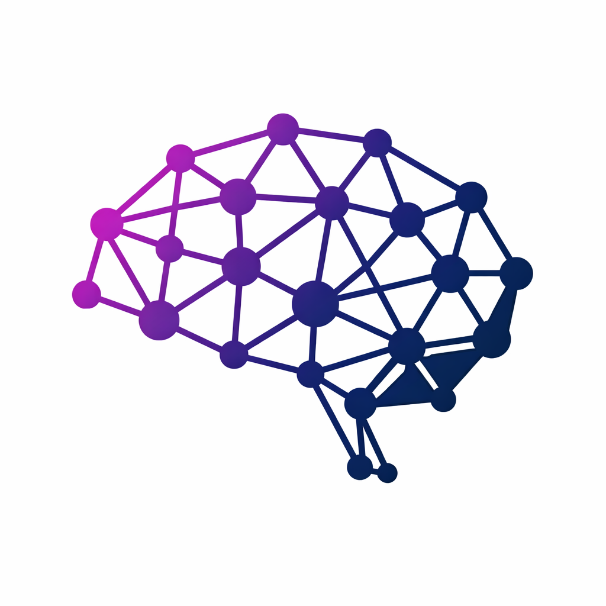

<p align="center">
  
</p>

# claude-teams-brain

[](LICENSE)
[](https://python.org)
[](https://nodejs.org)
[](https://claude.ai/claude-code)

**Persistent cross-session memory + intelligent output filtering for Claude Code.**

Claude Code's Agent Teams are powerful — but ephemeral. Every teammate spawns with a blank slate. Every session forgets what the last one built. And every shell command dumps thousands of tokens of raw output into your context window.

claude-teams-brain fixes both problems:

- **Cross-session memory** — automatically indexes everything your team produces and injects role-specific memory into every new teammate the moment they spawn
- **Output filtering** — command-aware filters reduce shell output by 80–99% before it enters context, so your agents run longer and smarter on the same context budget

Your AI team gets smarter with every session. No extra prompting. No manual context copying. No more starting from zero.

---

## What's New in v1.5

### Output Filtering — 80–99% Token Reduction on Shell Commands

Every command that runs through the brain's MCP tools is now filtered through an intelligent, command-aware pipeline before entering Claude's context window. The filters understand the structure of each command's output and strip noise while preserving signal.

**How it works:**

| Command | Raw Output | After Filtering | Savings |
|---------|-----------|----------------|---------|
| `git push` | Transfer stats, compression details, delta info | `ok main` | **98%** |
| `git add .` | (empty) | `ok (staged)` | **100%** |
| `npm install` | Warnings, notices, download bars, funding info | `added 542 packages in 12s` | **90%+** |
| `pytest` (all pass) | Session header, dots, collection info, timing | `15 passed in 2.34s` | **82%** |
| `pytest` (failures) | Full output including all passing tests | Summary + only failing tests with relevant assertion lines | **70%+** |
| `docker build` | Layer downloads, cache hits, SHA hashes | Build steps + errors only | **85%+** |
| `git diff` (large) | Full unified diff | File summary + per-hunk limits (30 lines max) | **60–90%** |
| `kubectl logs` | Thousands of repetitive log lines | Deduplicated by severity, top 10 errors with `[x5]` counts | **80%+** |
| `cargo build` | Compiling lines for every dependency | Error/warning summary with counts | **90%+** |

**60+ commands supported** across: git, npm/pnpm/yarn, pip/uv, pytest/jest/vitest/mocha, cargo, go test, docker, kubectl, helm, gcc/clang, eslint/ruff/pylint, make/cmake, grep/rg, curl/wget, brew/apt, and more.

**Filter pipeline (8 stages):**
1. Strip ANSI escape codes
2. Regex replacements
3. Short-circuit matching (e.g., `git push` → `ok <branch>`)
4. Strip/keep lines by pattern
5. Per-line length truncation
6. Head/tail with omission markers
7. Max lines cap
8. On-empty fallback messages

**Specialized parsers:**
- **Pytest** — state machine parser that tracks header → progress → failures → summary, shows up to 5 failures with only the relevant assertion lines
- **Jest/Vitest/Mocha** — structured failure extraction with summary preservation
- **Cargo test / Go test** — framework-specific failure block extraction
- **Build tools** — error/warning counting with top-5 error display
- **Log dedup** — normalizes timestamps, UUIDs, hex values, paths, and numbers before deduplicating; groups by severity (error/warning/info)
- **Git diff** — compacts diffs with per-file stats, 30-line hunk limits, and a summary header

Every filter degrades gracefully — if anything goes wrong, you get the raw output back. No data is ever lost.

### `/brain-learn` — Zero-Setup Convention Learning

Run one command. The brain scans your git history and **automatically learns** your project's conventions, architecture, file coupling patterns, and code hotspots. No manual `/brain-remember` needed — your repo teaches the brain.

```
> /brain-learn

Learned from Git History (187 commits)

  Conventions Added (6 new)
  - Convention: commit messages use Conventional Commits — common scopes: api, auth, db
  - Convention: branches use prefix naming (feature/, fix/, chore/)
  - Architecture: primary stack is TypeScript (Node.js)
  - Architecture: CI/CD uses GitHub Actions
  - Architecture: uses Docker for containerization
  - Convention: tests use *.test.ts naming

  Also Indexed
  - 12 file coupling patterns (searchable via /brain-search coupling)
  - 23 code hotspots (searchable via /brain-search hotspots)
```

Install the plugin on any existing repo, run `/brain-learn`, and your teammates instantly understand the project. Works on any stack, any repo size.

### Session Start Visibility

Every new session now shows a visible warmup banner in your terminal:

```
🧠 claude-teams-brain warming up...
   Indexed: CLAUDE.md, git-log, dir-tree, package.json
   Memory: 25 tasks · 17 decisions · 16 sessions
🧠 Brain ready.
```

No more guessing whether the brain is active — you see it working the moment Claude Code starts.

---

## Features at a Glance

| Feature | What It Does |
|---------|-------------|
| **Cross-session memory** | Indexes tasks, decisions, and files from every session. Injects role-specific context into new teammates automatically |
| **Output filtering** | 60+ command-aware filters reduce shell output by 80–99% before it enters context |
| **Auto-learn** | `/brain-learn` scans git history to extract conventions, architecture, and patterns |
| **Stack profiles** | `/brain-seed` loads pre-built conventions for Next.js, FastAPI, Go, React Native, Python |
| **Session KB** | `batch_execute` auto-indexes command output into a searchable knowledge base |
| **Solo mode** | Works without Agent Teams — memory builds from your own sessions |
| **Fully local** | SQLite database, no cloud, no telemetry, no external dependencies |
| **Cross-platform** | macOS, Linux, WSL2, native Windows — all hooks run via Python |

---

## Installation

**Requirements:** Python 3.8+, Node.js 18+, Claude Code v2.1+

> **Works on macOS, Linux, WSL2, and native Windows.** All hooks run via Python — no bash required.

### 1. Install the plugin

In Claude Code, run:

```
/plugin marketplace add https://github.com/Gr122lyBr/claude-teams-brain
/plugin install claude-teams-brain@claude-teams-brain
```

> **If `/plugin install` fails with "Source path does not exist":** This is a known Claude Code bug — `/plugin marketplace add` registers the marketplace but doesn't clone the repo to disk. Fix it by opening a **regular terminal** (Terminal, iTerm2, PowerShell, or WSL — not inside Claude Code) and running:
>
> ```bash
> bash <(curl -fsSL https://raw.githubusercontent.com/Gr122lyBr/claude-teams-brain/master/claude-teams-brain/scripts/install.sh)
> ```
>
> Then restart Claude Code. The script clones the repo, patches `known_marketplaces.json`, and sets up the plugin cache automatically.

### 2. Enable Agent Teams

Add to `~/.claude/settings.json`:

```json
{
  "env": {
    "CLAUDE_CODE_EXPERIMENTAL_AGENT_TEAMS": "1"
  }
}
```

If `settings.json` already has content, merge the `env` block:

```json
{
  "someExistingSetting": true,
  "env": {
    "YOUR_EXISTING_VAR": "value",
    "CLAUDE_CODE_EXPERIMENTAL_AGENT_TEAMS": "1"
  }
}
```

> **Solo mode:** Agent Teams is optional. If you skip this step, claude-teams-brain runs in solo mode — memory still builds from your own sessions and previous context is injected at every session start.

### 3. Allow agent tools (required for agents to write code)

When Claude spawns Agent Team teammates to build things, those agents need permission to read and write files. Without this, agents will be blocked from using Write/Edit and silently fail.

Add `allowedTools` to `~/.claude/settings.json`:

```json
{
  "env": {
    "CLAUDE_CODE_EXPERIMENTAL_AGENT_TEAMS": "1"
  },
  "allowedTools": [
    "Read",
    "Write",
    "Edit",
    "MultiEdit",
    "Bash",
    "Glob",
    "Grep",
    "TodoWrite",
    "TodoRead",
    "WebSearch",
    "WebFetch"
  ]
}
```

> **What this does:** `allowedTools` tells Claude Code to auto-approve these tools for all agents without prompting. This is safe for your own development machine — agents only run code you instruct them to run. Without it, background agents that need to create or edit files will be denied and report permission errors.

> **Alternative (per-session):** If you prefer to approve tools interactively, run Claude with `--dangerously-skip-permissions` for sessions where you want agents to work unattended. This skips all approval prompts for that session only.

Restart Claude Code after saving `settings.json`.

---

## Quick Start

> **Solo mode works too.** claude-teams-brain builds memory from your own sessions even without Agent Teams. But multi-agent teams produce richer, role-specific memory — the options below show how to trigger them.

### Step 0 — Bootstrap the brain (optional but recommended)

On an existing repo, run `/brain-learn` to instantly bootstrap the brain from your git history. On a new project, run `/brain-seed <profile>` instead. Either way, your teammates start informed from the very first session.

### Option A — Trigger a team manually

Paste this into Claude Code on any project:

```
Create an agent team to work on this project.
Spawn specialized teammates based on what the task needs —
for example: backend, frontend, tests, security, or architect.
Use role-specific names so claude-teams-brain can inject memory into each teammate.
```

### Option B — Make it automatic (recommended)

Add this to your project's `CLAUDE.md` file once, and Claude will always use Agent Teams without you having to ask:

```markdown
## Agent Teams

Always use agent teams for tasks that can be parallelized across concerns.
Spawn specialized teammates with role-specific names rather than doing everything
in a single session. Good team structures:

- Feature work: `backend`, `frontend`, `tests`
- Reviews: `security`, `performance`, `coverage`
- Architecture: `architect`, `devil-advocate`, `implementer`
- Debugging: name teammates after the hypothesis they're testing
- Research & writing: `researcher`, `writer`, `editor`

The claude-teams-brain plugin is active — each teammate will automatically receive
memory from past sessions relevant to their role.
```

> **Tip:** Role names are fully dynamic. Any name you use becomes a role. The brain routes memory by role name across sessions — so as long as you reuse the same names, memory builds up automatically.

---

## Why this matters

Agent Teams introduced true multi-agent parallelism to Claude Code — teammates that communicate directly, own separate file scopes, and collaborate without a single-session bottleneck. But they have two fundamental weaknesses:

> *Teammates exist for the duration of a session and then they're gone. No persistent identity, no memory across sessions, no `/resume`.*

> *Every shell command dumps its full raw output into the context window, burning through tokens on noise like progress bars, ANSI codes, and passing test output.*

This creates compounding problems on real projects. Your backend agent spent two hours establishing architecture decisions, learning your conventions, and building the auth system. Tomorrow, a new backend agent spawns and rediscovers everything from scratch. Meanwhile, a single `npm test` run floods 20,000 tokens of passing tests into context, pushing out the actual work.

claude-teams-brain solves both at the infrastructure level. It hooks into the Agent Teams lifecycle to build persistent memory, and it filters every command's output to keep only what matters — so your agents run longer, stay focused, and never start from zero.

---

## How It Works

### Memory System

claude-teams-brain hooks into seven lifecycle events:

| Hook | What happens |
|------|-------------|
| `SessionStart` | Brain initializes; indexes CLAUDE.md, git log, directory tree, and config files; injects tool guidance for output-efficient commands |
| `SubagentStart` | Role-specific memory injected — ranked by relevance to the current task, deduplicated |
| `TaskCompleted` | Task indexed immediately; shows `🧠 Indexed: [agent] task` confirmation |
| `SubagentStop` | Rich indexing: files touched, decisions made, output summary extracted from transcript |
| `PreToolUse` | Injects context for solo-mode tasks; suggests MCP tools for large-output commands |
| `TeammateIdle` | Passive checkpoint |
| `SessionEnd` | Full session compressed into a summary entry |

The `SubagentStart` hook is the core mechanism. When a teammate named `backend` spawns, the brain queries everything the backend agent has done across all past sessions — tasks completed, files owned, decisions made — ranks them by relevance to the current task description, deduplicates, and injects the result before the agent processes its first message.

### Output Filtering

The MCP server's `batch_execute` and `execute` tools automatically filter command output through an 8-stage pipeline before returning results to Claude:

1. **ANSI stripping** — removes escape codes and carriage-return overwrites
2. **Regex replacements** — chainable substitutions
3. **Short-circuit matching** — recognizes success patterns (e.g., `git push` transfer noise → `ok main`)
4. **Line filtering** — keeps or strips lines by regex pattern per command type
5. **Line truncation** — caps individual lines at command-appropriate lengths
6. **Head/tail** — keeps first/last N lines with `... (N lines omitted)` markers
7. **Max lines** — absolute cap to prevent context flooding
8. **On-empty fallback** — returns confirmation messages like `ok (staged)` instead of empty output

Raw output is still indexed into the session knowledge base for full-text search — only the filtered version enters Claude's context window.

### Session Warm-Up

At every `SessionStart`, the brain automatically pre-indexes:

| Source | What gets indexed |
|--------|------------------|
| `CLAUDE.md` | Project instructions and conventions (if > 200 bytes) |
| `git log` | Last 20 commits |
| Directory tree | Project file structure (3 levels deep, noise excluded) |
| Config files | `package.json`, `requirements.txt`, `pyproject.toml`, `Cargo.toml`, `go.mod` |
| Convention files | `.cursorrules`, `AGENTS.md`, `CONVENTIONS.md` (if present) |

All data lives in `~/.claude-teams-brain/projects/<project-hash>/brain.db` — a local SQLite database. Nothing is sent anywhere. No external dependencies beyond Python 3.8+ stdlib.

---

## Usage

Once installed, the brain works silently in the background. Just use Agent Teams normally.

**First session (cold start):**
```
You: Create an agent team to build the payments module.
     backend: API endpoints and business logic
     database: schema and migrations
     tests: integration test coverage

[Agent Teams session runs — claude-teams-brain indexes everything]
```

**Second session (warm start):**
```
You: Create an agent team to add webhook support to payments.
     backend: extend the existing payment API

[backend agent spawns and immediately receives:]
  "## 🧠 claude-teams-brain: Memory for role [backend]

   ### Project Rules & Conventions
   - Always use UUID v7 for all new database tables
   - All API endpoints must include rate limiting

   ### Your Past Work
   - Built payment API endpoints in /src/payments/api.ts
   - Implemented idempotency key validation middleware

   ### Key Team Decisions
   - [database] Using UUID v7 for all payment record IDs
   - [backend] Chose RS256 over HS256 for JWT — better key rotation
   - [backend] All payment endpoints require idempotency keys

   ### Files You Own
   - /src/payments/api.ts
   - /src/payments/middleware/idempotency.ts"
```

The teammate starts with full context from day one.

---

## Commands

| Command | Description |
|---------|-------------|
| `/brain-learn` | **Auto-learn conventions from git history** — detects commit style, branch naming, stack, CI/CD, test patterns, file coupling, and hotspots |
| `/brain-remember <text>` | Store a rule or convention injected into all future teammates |
| `/brain-forget <text>` | Remove a manually stored memory |
| `/brain-search <query>` | Search the full brain knowledge base directly |
| `/brain-export` | Export all brain knowledge as `CONVENTIONS.md` |
| `/brain-github-export` | Export `CONVENTIONS.md` and open a GitHub PR via `gh` CLI |
| `/brain-seed <profile>` | Seed the brain with pre-built stack conventions (e.g. `nextjs-prisma`, `fastapi`, `go-microservices`, `react-native`, `python-general`) |
| `/brain-replay [run-id]` | Replay a past session as a chronological narrative — timeline, decisions, files. Defaults to latest |
| `/brain-stats` | Full stats: persistent memory + session KB + output filter savings |
| `/brain-status` | Memory stats for this project |
| `/brain-query <role>` | Preview the context a new teammate would receive |
| `/brain-runs` | List past Agent Team sessions |
| `/brain-clear` | Reset all memory for this project |
| `/brain-update` | Pull the latest version from GitHub |

> **Note:** If a command does not appear in your list, prefix it with the plugin name: `/claude-teams-brain:brain-update`.

### Updating the plugin

> **On version < 1.1.2?** `/brain-update` had a bug where it silently skipped updating the install path, so after restart the old version kept loading. Skip `/brain-update` and use the bootstrap script below instead.

```
/brain-update
```

If you are on an older version, or if the update fails with a "Source path does not exist" error, run the bootstrap script instead.

**Run this in your terminal** (not inside Claude Code — open a regular terminal like Terminal, iTerm2, PowerShell, or WSL):

```bash
bash <(curl -fsSL https://raw.githubusercontent.com/Gr122lyBr/claude-teams-brain/master/claude-teams-brain/scripts/install.sh)
```

This clones/pulls the latest repo, patches `known_marketplaces.json`, and re-syncs the plugin cache. Then restart Claude Code.

If you prefer the manual steps:

```
/plugin marketplace remove claude-teams-brain
/plugin marketplace add https://github.com/Gr122lyBr/claude-teams-brain
```

Then run the bootstrap script above before running `/plugin install claude-teams-brain@claude-teams-brain`.

---

## MCP Tools

claude-teams-brain includes an MCP server that exposes five tools to Claude and all subagents. These tools keep large command output out of context windows by filtering it through command-aware pipelines and indexing results into a searchable session knowledge base.

> **Token savings in practice:** running `npm test` or `git log` via `batch_execute` typically returns 200–500 tokens of targeted results instead of 5,000–20,000 tokens of raw output — a **90–97% reduction** per call. The output filtering adds another layer on top, stripping noise before indexing. Use `stats` at the end of a session to see your actual savings.

### batch_execute

Run multiple shell commands, auto-filter and index all output, and search with queries in a single call. Identical commands within the same session are served from a **60-second cache** — no redundant process spawns, no duplicate context.

```json
{
  "commands": [
    {"label": "git log", "command": "git log --oneline -20"},
    {"label": "test results", "command": "npm test 2>&1"}
  ],
  "queries": ["recent commits about auth", "failing tests"],
  "timeout": 60000
}
```

### search

Search the session knowledge base built by previous batch_execute or index calls.

```json
{
  "queries": ["authentication middleware", "error handling patterns"],
  "limit": 3
}
```

### index

Manually index content (findings, analysis, data) for later retrieval.

```json
{
  "content": "The auth module uses RS256 JWT tokens with 15-minute expiry...",
  "source": "auth-analysis"
}
```

### execute

Run code in a sandboxed subprocess. Set `intent` to auto-index and search large output. Shell commands are automatically filtered through the output pipeline.

```json
{
  "language": "python",
  "code": "import ast; print(ast.dump(ast.parse(open('main.py').read())))",
  "timeout": 30000,
  "intent": "find all class definitions"
}
```

Supported languages: `shell`, `javascript`, `python`.

### stats

Show session context savings metrics including output filter performance.

```json
{}
```

Returns bytes indexed vs bytes returned, call counts, cache hits, context savings ratio, and output filter stats (commands filtered, reduction percentage, estimated tokens saved).

---

## Project Structure

```
claude-teams-brain/                    ← repo root (marketplace)
  .claude-plugin/
    marketplace.json
  claude-teams-brain/                  ← the plugin
    .claude-plugin/
      plugin.json
    hooks/
      hooks.json                       ← 7 lifecycle hooks (all via Python)
    mcp/
      server.mjs                       ← MCP server with 5 tools
      executor.mjs                     ← sandboxed code execution
      output_filter.mjs                ← command-aware output filtering (60+ commands)
    scripts/
      hook_runner.py                   ← cross-platform hook dispatcher
      brain_engine.py                  ← SQLite engine (pure stdlib)
      update.sh                        ← pulled by /brain-update
    profiles/                          ← stack convention profiles
      nextjs-prisma.json               ← Next.js + Prisma + TypeScript
      fastapi.json                     ← FastAPI + SQLAlchemy async
      go-microservices.json            ← Go + chi + pgx
      react-native.json                ← React Native + Expo
      python-general.json              ← Python 3.11+ modern stack
    commands/                          ← /brain-* slash commands
    skills/                            ← skill definitions
    settings.json                      ← Agent Teams env config
```

---

## Memory Storage

```
~/.claude-teams-brain/
  └── projects/
      └── <project-hash>/
          └── brain.db    ← SQLite, one file per project
```

Each project has its own isolated brain. Memory never crosses project boundaries. The SQLite file is fully inspectable with any database viewer.

---

## Tips

- **Existing repo? Run `/brain-learn` first** — the brain scans your git history and auto-extracts conventions, architecture signals, file coupling, and hotspots. One command, zero config, instant context
- **New project? Run `/brain-seed` instead** — pick a stack profile (`nextjs-prisma`, `fastapi`, `go-microservices`, `react-native`, `python-general`) and teammates start informed from session one
- **Use descriptive agent names** that match their role (`backend`, `database`, `security`) — the brain routes memory by role name
- **Memory compounds** — the first session is cold, but quality improves significantly from the second session onwards
- **Use `/brain-remember`** to store project-specific conventions — teammates will receive them immediately
- **Run `/brain-query backend`** to preview exactly what context the backend agent will receive before spawning
- **Run `/brain-replay latest`** after a session to review what your AI team did — great for standups or catching up after a break
- **Run `/brain-github-export`** to open a PR with accumulated conventions — makes AI knowledge visible to your whole human team
- **CLAUDE.md, `.cursorrules`, and `AGENTS.md` are auto-indexed** at every session start — teammates can search them immediately
- **Use `stats` tool** to see output filter savings at the end of a session — track how many tokens the filters saved
- **Solo mode works without Agent Teams** — memory still builds from your own sessions; previous context is injected at every session start automatically

---

## Troubleshooting

### "Source path does not exist" on install or reinstall

**Cause:** Claude Code's `/plugin marketplace add` registers the marketplace in `known_marketplaces.json` but does not clone the repo to disk. The installer then can't find the source files.

**Fix:** Open a **regular terminal** (Terminal, iTerm2, PowerShell, or WSL — not inside Claude Code) and run the bootstrap script:

```bash
bash <(curl -fsSL https://raw.githubusercontent.com/Gr122lyBr/claude-teams-brain/master/claude-teams-brain/scripts/install.sh)
```

Then restart Claude Code. You do not need to run `/plugin install` again — the script sets up the cache directly.

### Manual workaround (no curl)

```bash
git clone https://github.com/Gr122lyBr/claude-teams-brain.git \
  ~/.claude/plugins/marketplaces/claude-teams-brain
```

Then run `/plugin install claude-teams-brain@claude-teams-brain` inside Claude Code and restart.

### Plugin not active after update

Run `/brain-update` to re-sync. If the command isn't available, use the bootstrap script above.

---

## License

MIT
